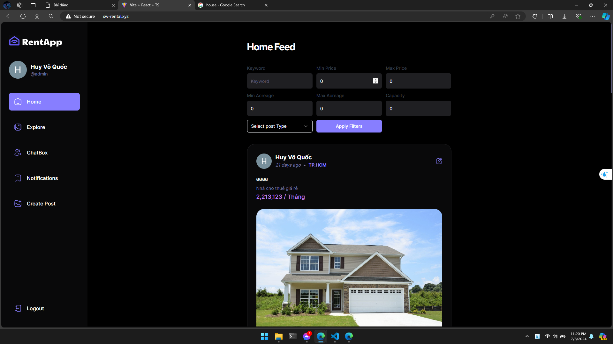

# Support finding accommodation website

For freshmen university students, when their homes are far from school, it becomes inconvenient to commute to campus. Our website aims to help RENTERS find suitable accommodations posted by LANDLORDS. Posts can be filtered by range, price, capacity, and more. Furthermore, we have integrated the Microsoft Map API to show posts near a dropped pin.

## Table of contents

- [Features](#features)
- [System Architecture](#system-architecture)
- [Database Schema Diagram](#database-schema-diagram)
- [Getting Started](#getting-started)
- [Admin UI](#admin-ui)
- [User UI](#user-ui)

## Features

#### 1. Authenticate & Authorize

- Authenticated via JWT token
- Role-based authorize: ADMIN, RENTER, LANDLORD

#### 2. Google Authenicate & Real-time chat

- New user can sign in via Google Account as RENTER
- Create/Find conversations with other users (sending images is supported)

#### 3. Post management

- **Flow**: LANDLORD uploads post --> ADMIN checks --> Activated posts are visible to all users
- Users can **report** posts if they find them unreliable (Spam, Fake news, Wrong coordinates, etc.). Once ADMIN notices a high report count, they can remove the post (make it invisible)

## System Architecture


## Database Schema Diagram


## Getting Started

- Our Client website deployed at [Rental Housing Support Website](http://sw-rental.xyz)
- Admin Site: [Admin site](http://sw-rental.xyz/RentApp/)

**Here are demo account:**

```bash
# ROLE: username - password
ADMIN: admin - 123456
RENTER: user1 - 123456
LANDLORD: user2 - 123456
```

## Admin UI

</img>
</img>
</img>

## User UI

</img>
</img>
</img>
</img>
</img>

<a href="#support-finding-accommodation-website" style="transition: all .25s ease-in-out; position: fixed; bottom: 0; right: 0; display: inline-flex; cursor: pointer; align-items: center; justify-content: center; margin: 0 2em 2em 0; padding: .25em; width: 8em; height: 2em;">
  🔼 Back to top
</a>
